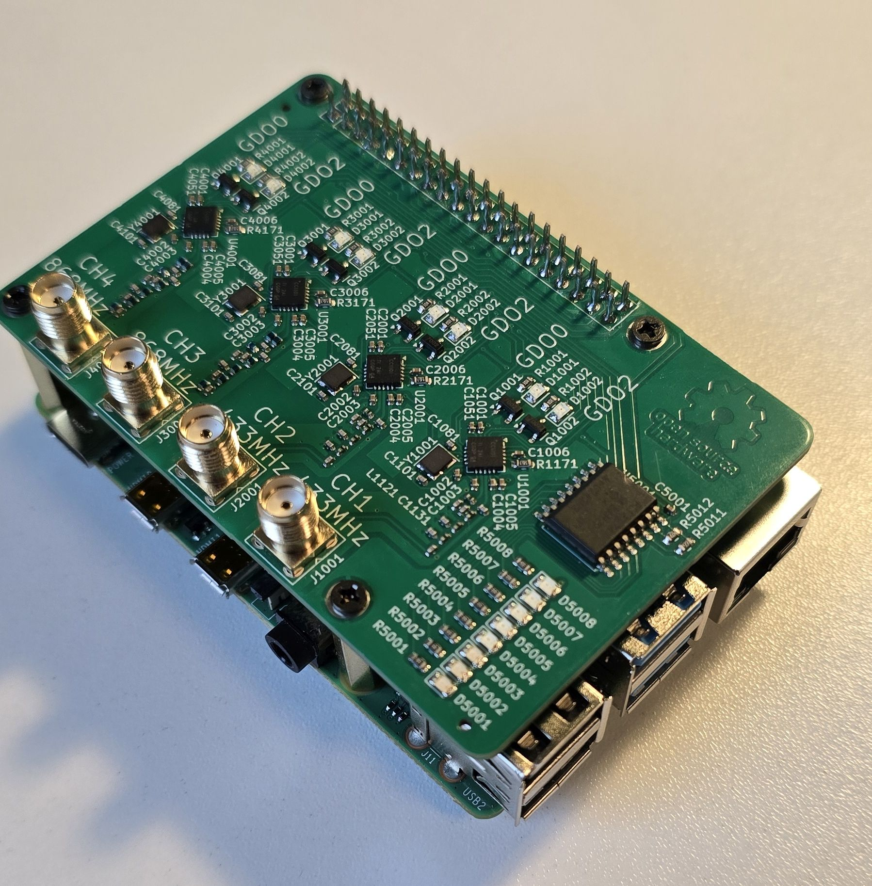

# PCB CC1101_RPi



## Wiring

| CH1, 433 MHz | CH2, 433 MHz | CH3, 868 MHz | CH4, 868 MHz | Raspberry Pi | Meaning      |
|--------------|--------------|--------------|--------------|--------------|--------------|
| VDD          | VDD          | -            | -            | 3.3V         | Power Supply |
| GND          | GND          | -            | -            | GND          | Ground       |
|              |              |              |              |              |              |
| MOSI         | MOSI         | -            | -            | GPIO10       | SPI0 MOSI    |
| MISO         | MISO         | -            | -            | GPIO9        | SPI0 MISO    |
| SCK          | SCK          | -            | -            | GPIO11       | SPI0 SCLK    |
|              |              |              |              |              |              |
| CSN          | -            | -            | -            | GPIO8        | SPI0 CE0     |
| GDO0         | -            | -            | -            | GPIO5        | -            |
| GDO2         | -            | -            | -            | GPIO6        | -            |
|              |              |              |              |              |              |
| -            | CSN          | -            | -            | GPIO7        | SPI0 CE1     |
| -            | GDO0         | -            | -            | GPIO22       | -            |
| -            | GDO2         | -            | -            | GPIO23       | -            |
|              |              |              |              |              |              |
| -            | -            | MOSI         | MOSI         | GPIO20       | SPI1 MOSI    |
| -            | -            | MISO         | MISO         | GPIO19       | SPI1 MISO    |
| -            | -            | SCK          | SCK          | GPIO21       | SPI1 SCLK    |
|              |              |              |              |              |              |
| -            | -            | CSN          | -            | GPIO18       | SPI1 CE0     |
| -            | -            | GDO0         | -            | GPIO24       | -            |
| -            | -            | GDO2         | -            | GPIO25       | -            |
|              |              |              |              |              |              |
| -            | -            | -            | CSN          | GPIO17       | SPI1 CE1     |
| -            | -            | -            | GDO0         | GPIO26       | -            |
| -            | -            | -            | GDO2         | GPIO27       | -            |

# Setup

Enable I2C and SPI in `/boot/firmware/config.txt`:

```
dtparam=i2c_arm=on
dtparam=spi=on
dtoverlay=spi1-2cs
```
