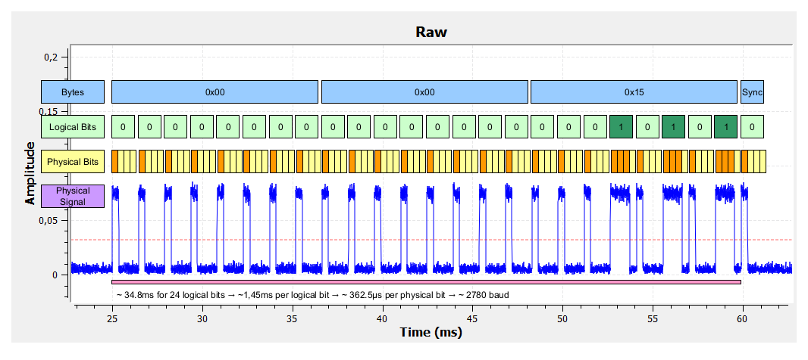

# Priceton24bit Protocol

In this example, a remote control is used as a signal reference. At first, the signal was recorded with a software defined radio:


As you can see, the signal contains short and long pulses.
* a short pulse (1t), followed by a long brake (3t) is a logical one
* a long pulse (3t), followed by a short brake (1t) is a logical zero

There are 25 pulses displayed. From the first rising edge to the last rising edge, approx. 34.8ms are elapsed.

34.8ms / 24 logical bits = 1.45ms per logical bit

Each logical bit contains 4 physical bits, so each physical bit lasts 362.5µs. So the baudrate is 1/0.0003625, approx. 2780 baud.



The last bit is a sync bit, which is always zero.

In the coding example `receiver.py`, at least 22 bits are required for a valid signal. Sometimes, the first bits are missing. In this case, we assume, that they are zeros.

```bash
(venv) pi@RaspberryPiDev:~/cc1101/cc1101 $ python examples/princeton24bit/receiver.py
INFO:epCC1101.rpi_driver:Initializing SPI device on bus 0, cs_pin 0, spi_speed_hz 55700
INFO:epCC1101.cc1101:Initializing CC1101 device
INFO:epCC1101.configurator:12   Data rate: 2.777 kbps
INFO:epCC1101.configurator:13   Receiver bandwidth: 101.562 kHz
INFO:epCC1101.configurator:14.1 Frequency offset compensation setting:
INFO:epCC1101.configurator:     FOC_BS_CS_GATE: 0 (Always on)
INFO:epCC1101.configurator:     FOC_PRE_K: 2 (3K)
INFO:epCC1101.configurator:     FOC_POST_K: 1 (K/2)
INFO:epCC1101.configurator:     FOC_LIMIT: 0 (±0 No compensation)
INFO:epCC1101.configurator:14.3 Byte synchronization mode: 0 (No preamble/sync)
INFO:epCC1101.configurator:14.3 Synchronization word: 0xD391
INFO:epCC1101.configurator:15.1 Data whitening: 0
INFO:epCC1101.configurator:15.2 Preamble length: 2 bytes
INFO:epCC1101.configurator:     Packet length mode: 2 (Infinite)
INFO:epCC1101.configurator:     Packet length: 255 bytes
INFO:epCC1101.configurator:     CRC enabled: 0
INFO:epCC1101.configurator:     Address check mode: 0 (No address check)
INFO:epCC1101.configurator:     Address: 0
INFO:epCC1101.configurator:15.3 CRC auto flush: 0
INFO:epCC1101.configurator:     Append status: 1
INFO:epCC1101.configurator:15.4 FEC enabled: 0
INFO:epCC1101.configurator:15.5 GDO0 configuration: 0x0B
INFO:epCC1101.configurator:     GDO1 configuration: 0x2E
INFO:epCC1101.configurator:     GDO2 configuration: 0x0C
INFO:epCC1101.configurator:     GDO0 inverted: 0
INFO:epCC1101.configurator:     GDO1 inverted: 0
INFO:epCC1101.configurator:     GDO2 inverted: 0
INFO:epCC1101.configurator:16   Modulation format: 3 (ASK_OOK)
INFO:epCC1101.configurator:     Manchester encoding: 0
INFO:epCC1101.configurator:16.1 Frequency deviation: 5.157 kHz
INFO:epCC1101.configurator:21   Base frequency: 433.940 MHz
INFO:epCC1101.configurator:27   Packet format: 1
INFO:epCC1101.configurator:XXX  AGC filter length: 1
INFO:epCC1101.configurator:     AGC freeze: 0
INFO:epCC1101.configurator:     AGC wait time: 1
INFO:epCC1101.configurator:     AGC hysteresis level: 2
INFO:epCC1101.configurator:     AGC carrier sense absolute threshold: 0
INFO:epCC1101.configurator:     AGC carrier sense relative threshold: 0
INFO:epCC1101.configurator:     AGC LNA priority: 1
INFO:epCC1101.configurator:     AGC magnitude target: 3
INFO:epCC1101.configurator:     AGC max LNA gain: 0
INFO:epCC1101.configurator:     AGC max DVGA gain: 0
INFO:__main__:Waiting for Packet...
INFO:epCC1101.cc1101:Receiving data
INFO:epCC1101.cc1101:Flushing RX FIFO
INFO:epCC1101.cc1101:Setting device to IDLE state
INFO:__main__:[1, 0, 0, 0, 1, 0, 0, 0, 1, 0, 0, 0, 1, 0, 0, 0, 1, 0, 0, 0, 1, 0, 0, 0, 1, 0, 0, 0, 1, 0, 0, 0, 1, 0, 0, 0, 1, 0, 0, 0, 1, 0, 0, 0, 1, 0, 0, 0, 1, 0, 0, 0, 1, 0, 0, 0, 1, 0, 0, 0, 1, 0, 0, 0, 1, 0, 0, 0, 1, 0, 0, 0, 1, 0, 0, 0, 1, 1, 1, 0, 1, 0, 0, 0, 1, 1, 1, 0, 1, 0, 0, 0, 1, 1, 1, 0, 1, 0, 0, 0, 0, 0, 0, 0, 0, 0, 0, 0, 0, 0, 0, 0, 0]
[0, 0, 0, 0, 0, 0, 0, 0, 0, 0, 0, 0, 0, 0, 0, 0, 0, 0, 0, 1, 0, 1, 0, 1, 0]
INFO:__main__:Packet parsed successfully.
INFO:__main__:PrincetonPacket(0x00 0x00 0x15)
INFO:__main__:Waiting for Packet...
INFO:epCC1101.cc1101:Receiving data
INFO:epCC1101.cc1101:Flushing RX FIFO
INFO:epCC1101.cc1101:Setting device to IDLE state
...
INFO:__main__:Waiting for Packet...
INFO:epCC1101.cc1101:Receiving data
INFO:epCC1101.cc1101:Flushing RX FIFO
INFO:epCC1101.cc1101:Setting device to IDLE state
INFO:__main__:[0, 0, 0, 1, 0, 0, 0, 1, 0, 0, 0, 1, 0, 0, 0, 1, 0, 0, 0, 1, 0, 0, 0, 1, 0, 0, 0, 1, 0, 0, 0, 1, 0, 0, 0, 1, 0, 0, 0, 1, 0, 0, 0, 1, 0, 0, 0, 1, 0, 0, 0, 1, 0, 0, 0, 1, 0, 0, 0, 1, 0, 0, 0, 1, 0, 0, 0, 1, 0, 0, 0, 1, 0, 0, 0, 1, 1, 1, 0, 1, 0, 0, 0, 1, 1, 1, 0, 1, 0, 0, 0, 1, 0, 0, 0, 1, 0, 0, 0, 0, 0, 0, 0, 0, 0, 0, 0, 0, 0, 0, 0, 0]
[0, 0, 0, 0, 0, 0, 0, 0, 0, 0, 0, 0, 0, 0, 0, 0, 0, 0, 1, 0, 1, 0, 0, 0]
INFO:__main__:Packet parsed successfully.
INFO:__main__:PrincetonPacket(0x00 0x00 0x14)
...
```